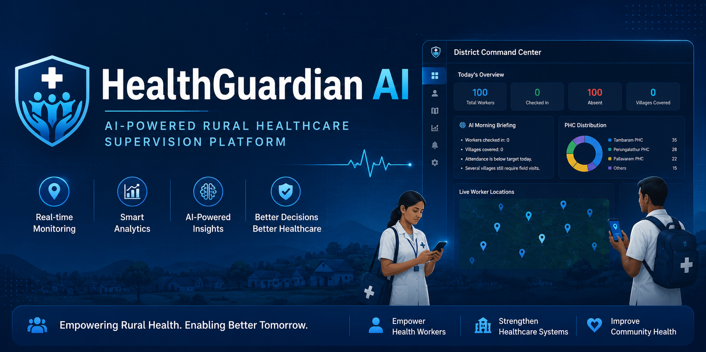
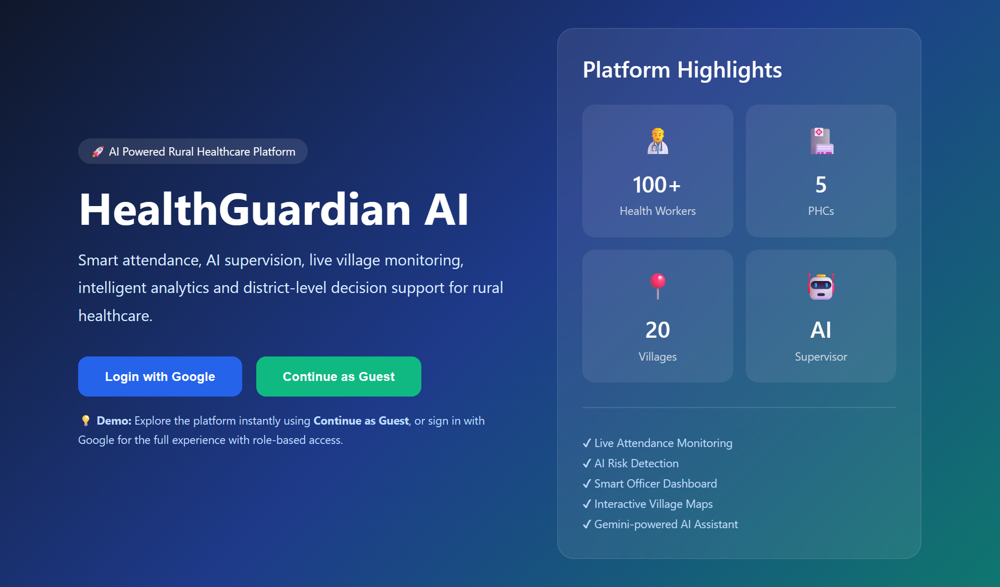
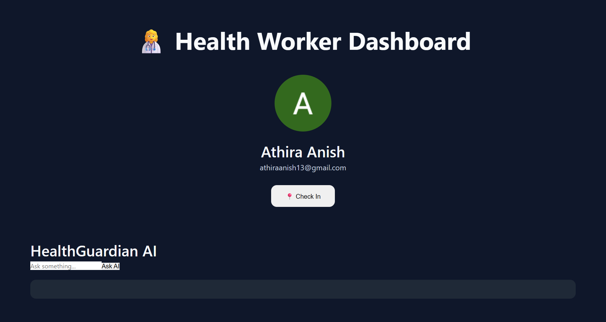
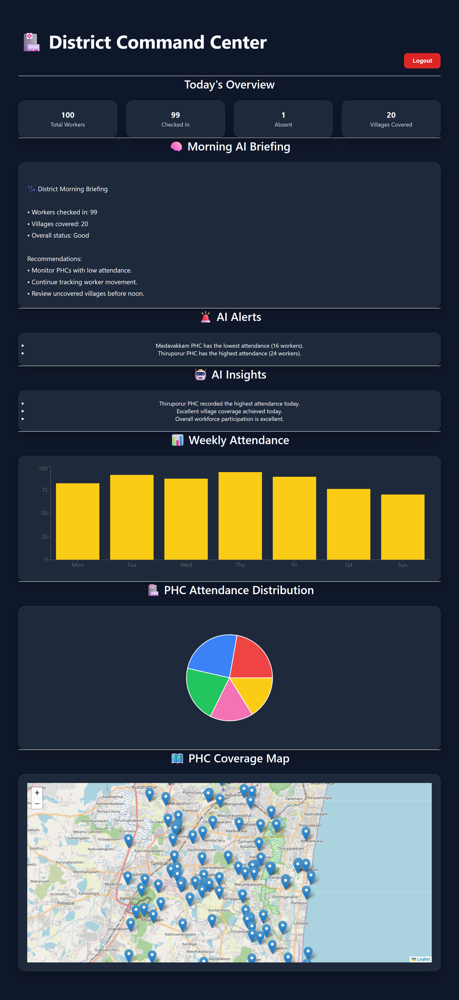
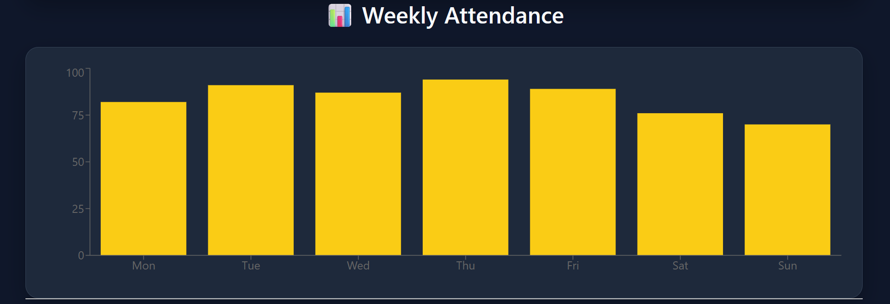
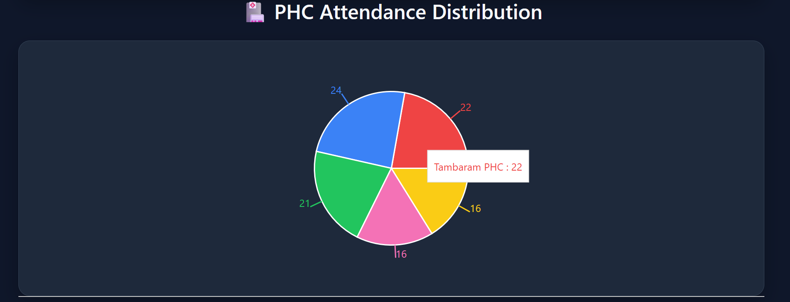
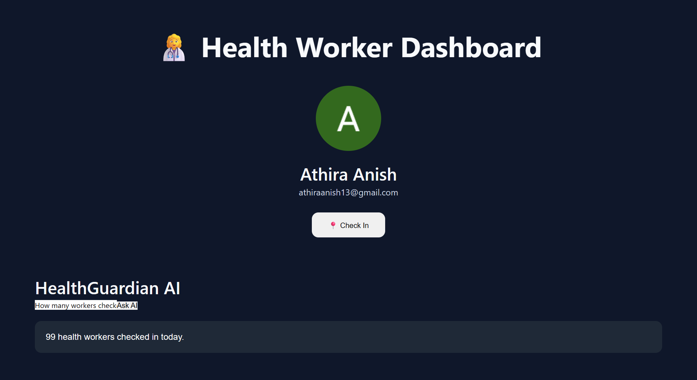
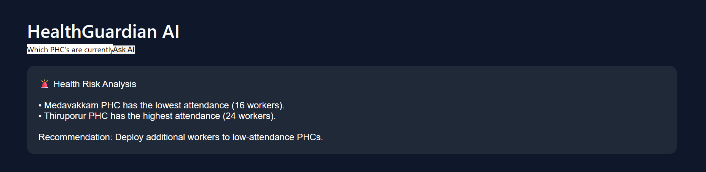
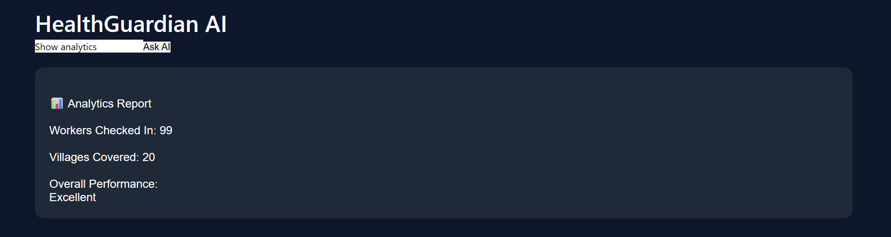

<p align="center">
  
</p>

# 🏥 HealthGuardian AI

> **AI-Powered Rural Healthcare Supervision Platform**

HealthGuardian AI is a full-stack AI platform that enables District Medical Officers to monitor rural healthcare workers through live attendance tracking, GPS-enabled check-ins, AI-generated insights, and interactive analytics.

---

## 🌐 Live Demo

**Live Application:** https://health-guardian-ai-gamma.vercel.app

**Backend API:** https://healthguardian-ai-backend.onrender.com

> 💡 Explore instantly using **Continue as Guest**, or sign in with Google for the complete role-based experience.

---

## 📌 Problem Statement

Monitoring rural healthcare workers across multiple villages is often inefficient due to manual attendance systems, limited visibility into field operations, and delayed reporting.

HealthGuardian AI addresses these challenges through AI-powered supervision, real-time attendance tracking, intelligent analytics, and district-level decision support.

---

# ✨ Key Features

### 👨‍⚕️ Health Worker Portal

- Secure Google Authentication
- One-click attendance check-in
- GPS location capture
- AI-powered assistant
- Cloud-based attendance logging

### 🏥 District Officer Dashboard

- Live attendance overview
- AI-generated Morning Briefing
- AI Alerts
- AI Insights
- Weekly attendance analytics
- PHC-wise attendance distribution
- Interactive village coverage map
- Read-only Guest Demo mode

---

# 🤖 AI Capabilities

HealthGuardian AI uses Google Gemini to provide intelligent assistance and automated supervision.

Current AI features include:

- AI Morning Briefings
- Attendance Summaries
- PHC Analytics
- Risk Detection
- District Insights
- Supervisor Agent

---

# ⚙️ Technology Stack

## Frontend

- React
- Vite
- Firebase Authentication
- Recharts
- React Leaflet

## Backend

- FastAPI
- Python
- Firebase Admin SDK

## Database

- Firebase Firestore

## AI

- Google Gemini 2.5 Flash

## Deployment

- Vercel
- Render

---

# 📸 Screenshots

## Landing Page



Modern landing page featuring Google Authentication and Guest Demo Mode for quick evaluation.


---

## Worker Dashboard



Health workers can securely check in, automatically capture GPS location, and interact with the Gemini-powered AI assistant.

---

## Officer Dashboard



Real-time district dashboard displaying attendance statistics, AI-generated morning briefing, analytics, charts, and operational insights.

---

## 🗺 Live Village Monitoring


Interactive map visualizing the live locations of health workers across villages.

---

## 📊 Analytics Dashboard





Weekly attendance trends and PHC-wise workforce distribution help officers quickly understand field operations.

---

## AI Assistant







Gemini-powered assistant capable of answering attendance questions and generating intelligent operational insights.

---

# 📂 Project Structure

```text
HealthGuardian-AI

├── backend
│   ├── agents
│   ├── services
│   ├── scripts
│   └── main.py
│
├── frontend
│   ├── components
│   ├── context
│   ├── pages
│   ├── services
│   └── firebase
│
└── README.md
```

---

# 🚀 Running Locally

### Backend

```bash
cd backend

pip install -r requirements.txt

uvicorn main:app --reload
```

### Frontend

```bash
cd frontend

npm install

npm run dev
```

---

# 🔮 Future Enhancements

- Predictive workforce allocation
- Offline attendance synchronization
- Automated notification system
- Multi-district support
- Healthcare resource forecasting

---

# 👩‍💻 Author

**Athira Anish**

Computer Science Engineering • AI • Data Science

GitHub: https://github.com/Athira286

LinkedIn: *(Add your LinkedIn URL)*

---

⭐ If you found this project interesting, consider giving it a star.